# [TermuxPy] (1.2.5) Python 3 for Termux
************************************************** ***********************************
<b> IMPORTANT (22/JAN/2020): Due to Python 3.8 update issues in Termux, at this time termuxpy does not work correctly (it doesn't install numpy + scipy + matplotlib). It will be tracked to correct this error. </b>


<b> Altenative: It is recommended to use the following free application for Android [Pydroid 3 - IDE for Python 3
](https://play.google.com/store/apps/details?id=ru.iiec.pydroid3), which contains scipy, numpy, matplotlib, jupyter, graphic support for tkinter!!, and other interesting  modules. </b>

************************************************** ***********************************


Version (1.2.5) - <b>Modification date: 23/AUG/2019</b><br>
[](LICENSE)
[](https://www.paypal.me/natanvilchis) <br>
Python3 + Numpy + Scipy + Matplotlib for Termux. <br>
An automated script to install Python 3 and scientific libraries for Termux (Android) 

*Read in other languages: [Spanish](README.md), [English](README.en.md)*

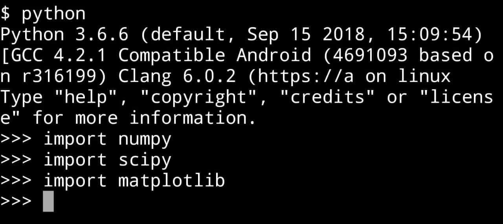
 
## Table of Contents
  - [Version notes](#version-notes)
  - [Pre requirements](#pre-requirements)
    - [Write permissions activated](#write-permissions)
    - [Install Git](#install-git)
      - [1) Install Git:](#install-git-termux)
      - [2) Accept the installation of Git:](#accept-installation)
      - [3) Wait until the installation is finished: ](#wait-git)
  - [Installation](#installation)
    - [1) Get TermuxPy](#get-termuxpy)
    - [2) Open folder termuxpy](#open-termuxpy)
    - [3) Run termuxpy.sh](#run-script-termuxpy)
  - [Example](#example)
    - [1) Go to the example folder](#folder-example)
    - [2) Run example with Python ](#run-example-python)
    - [3) Graphic image file ](#graphic-python)

## Version notes
Version (1.2.5) - <b>Modification: 23/AUG/2019</b> <br>
Added support for 64-bit processors. Now termuxpy no longer needs to run twice.

Version (1.2.4) - <b>Modification: 23/AUG/2019</b> <br>
A correction has been added to prevent the shutdown of the installation when a package has been depreciated or renamed.

Versión (1.2.3) - <b>Modification date: 17/ABR/2019 </b> <br>
Support for terminals that by default have the environment variable LD_LIBRARY_PATH blank and can not be installed correctly numpy, scipy and matplotlib. <br><br>

Versión (1.2.2) - <b>Modification date: 17/ABR/2019 </b> <br>
Support for new version of termux, addition of library "zlib-dev" for correct compilation of matplotlib<br><br>

Version (1.2.1) - <b>Modification date: 16/MAR/2019 </b> <br>
The modification was added to run the latest version of matplotlib (3.0.3) <br>
<b> Major improvement!: </b><br>
The matplotlib 3.0.3 version will automatically detect the backend "Agg", this is explained as follows,: <br>

Old import:
```python
import matplotlib
matplotlib.use ("Agg")
import matplotlib.pyplot as a plot
```

The previous code can be simplified by (giving the same result):
```python
import matplotlib.pyplot as a plot
```
<b> Important </b>: This did NOT provide graphics availability by using <b> plot.show() </b>, to save the graphics it is recommended to use plot.savefig(file_name).<br> <br>

Version (1.2.0) - <b>Modification date: 18/NOV/2018</b><br>
Modification was added to run the latest version of matplotlib (3.0.2)<br>

## Pre requirements
It is necessary to have approximately <b> 380 MB </b> of free space for a correct installation (the size may vary for later updates).

### Write permissions activated
Have the Termux write permissions enabled (Settings => Apps => Termux => Permissions => Storage) <br>
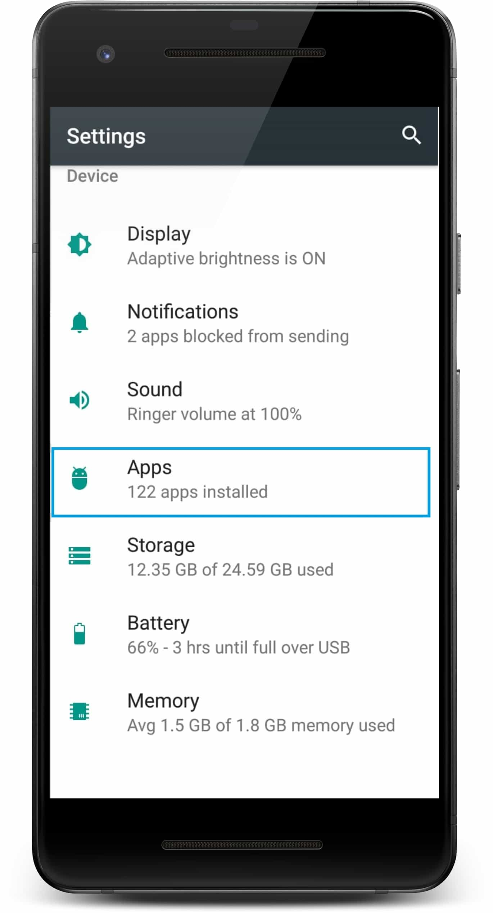
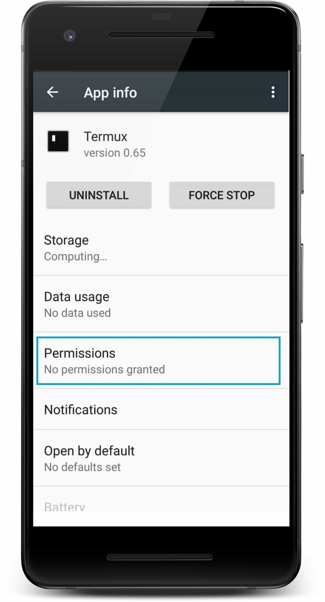


### Install Git
Install Git in Termux:  
#### 1) Install Git:
Execute the following command in termux: <br>
```
pkg install git
```


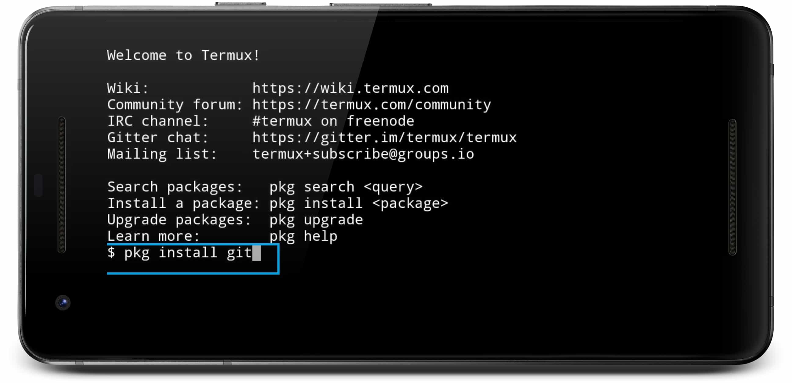 <br>
#### 2) Accept the installation of Git:
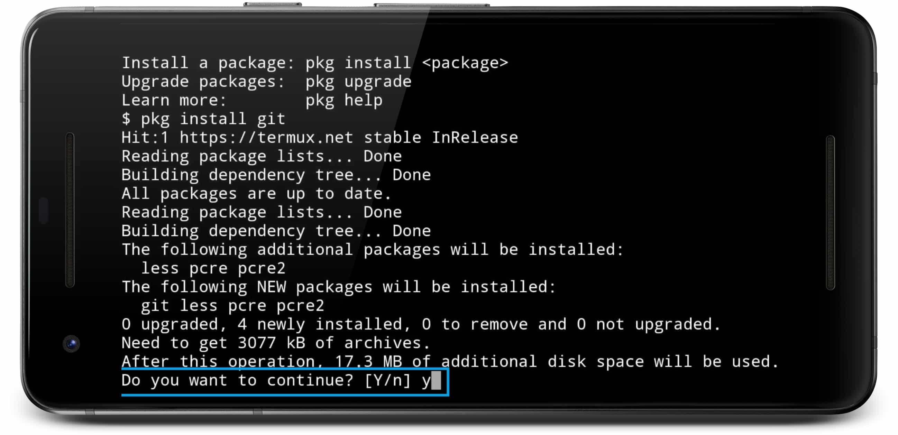 <br>
#### 3) Wait until the installation finishes:
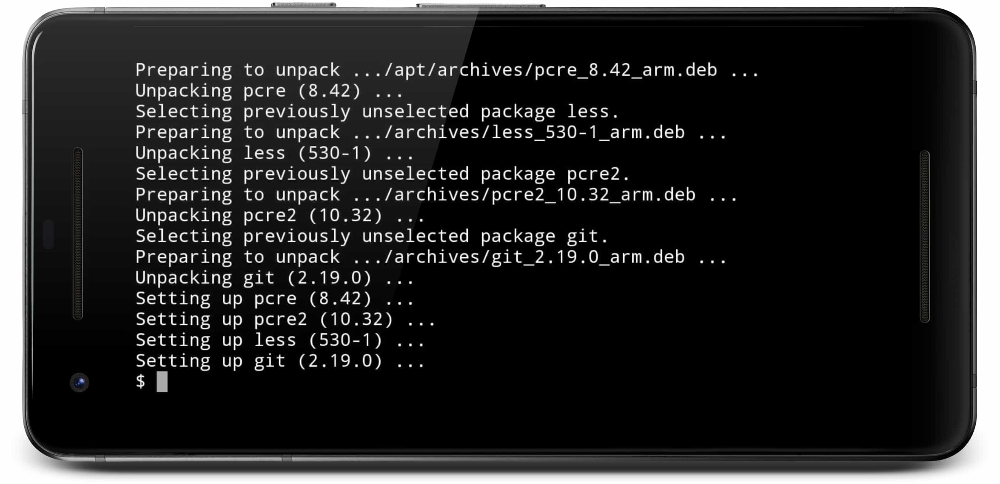 <br>

## Installation
### 1) Get TermuxPy
Execute the following command in termux: <br>
````
git clone https://github.com/NatanVilchis/termuxpy
````
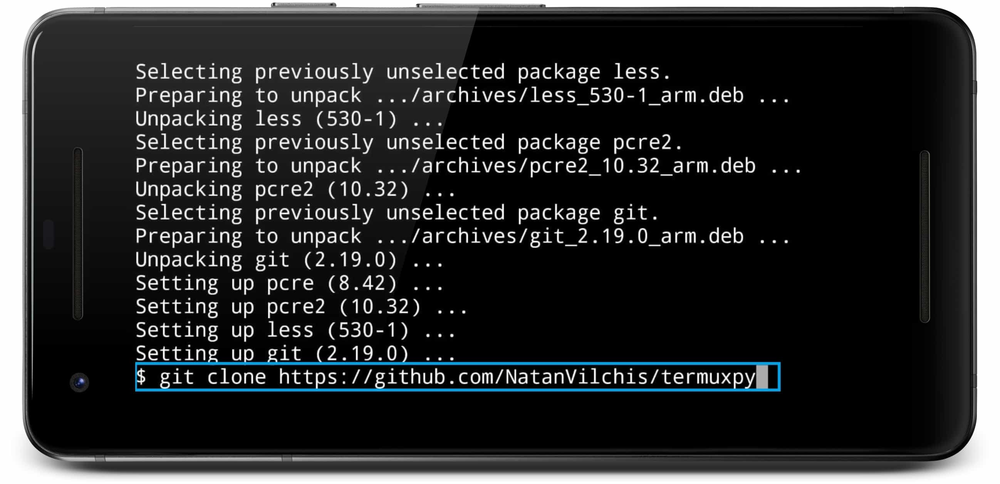 <br>
Wait until get the entire repository: <br>
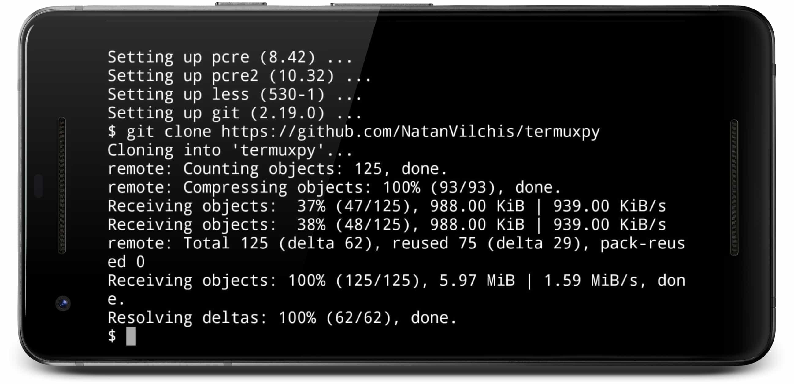 <br>
### 2) Open folder termuxpy
Execute the following command in termux: <br>
````bash
cd termuxpy
````
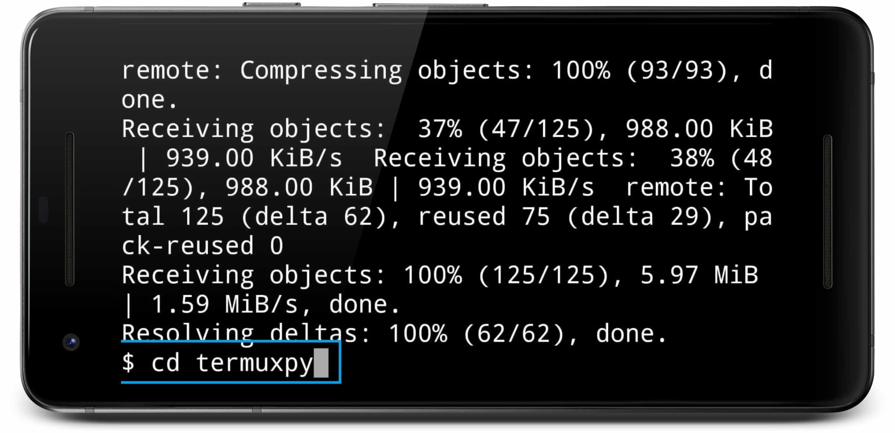 <br>

### 3) Run termuxpy.sh
Execute the following command in termux: <br>
````
bash termuxpy.sh
````
<b> It's important that while the installation is in process the device will not sleep because it can generate a corrupted installation </b> <br>


 <br>
Wait until the installation is finished:
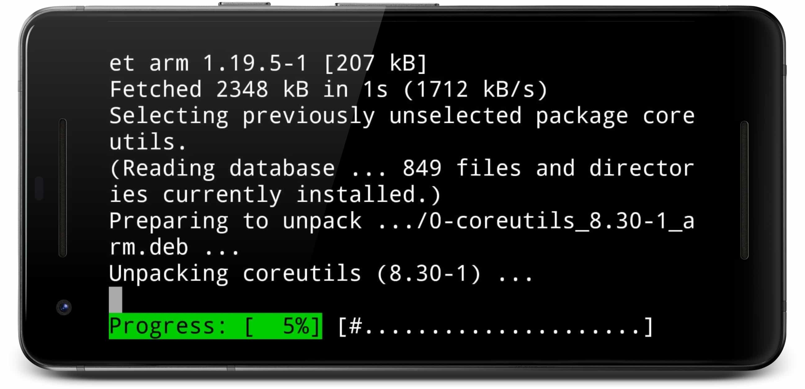 <br>

<b>Note (for some devices):</b><br>
It's possible that some devices don't have the environment variable <b>LD_LIBRARY_PATH </b> assigned correctly, in this case, the following message will be displayed:<br>
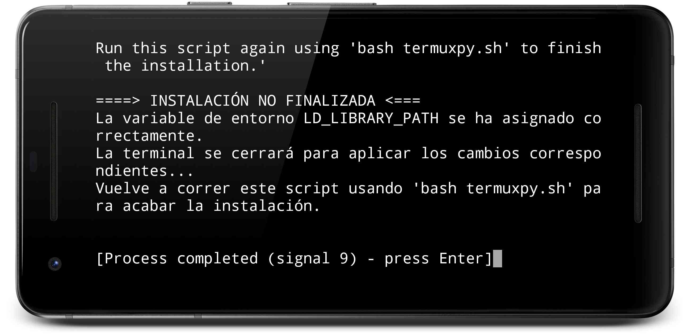 <br>
To continue with the installation go to the folder where "termuxpy" was downloaded and execute the command again:
````bash
bash termuxpy.sh
````
The installation will now end without problems. <br><br>


## Example
This repository has an example to generate a graph using the matplotlib library
### 1) Go to the example folder
````bash
cd ejemplo
````
 <br>

### 2) Run example with Python
Execute the following command in termux: <br>
````
python normal_pdf.py
````
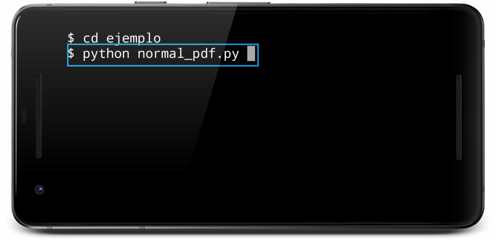 <br>


The example will be executed showing the graphic when you press the enter key <br>
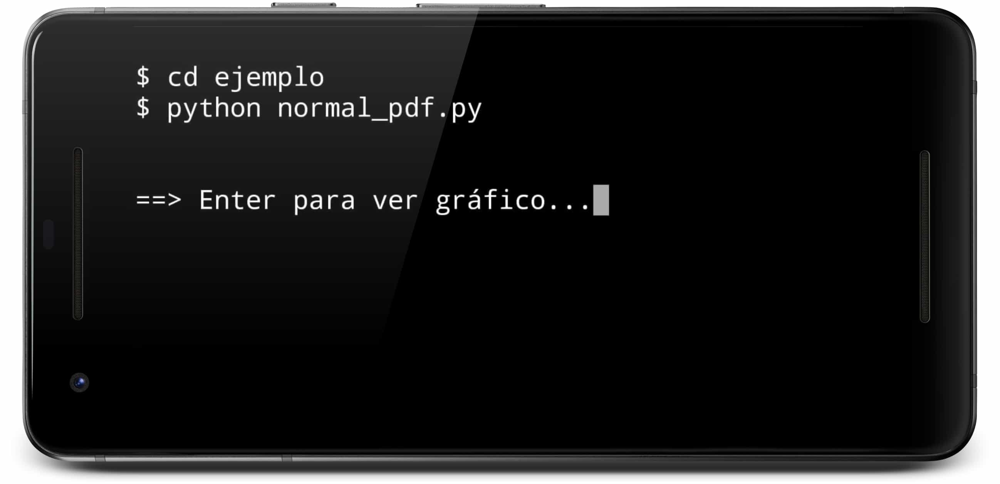 <br>
Generated graphic:
 
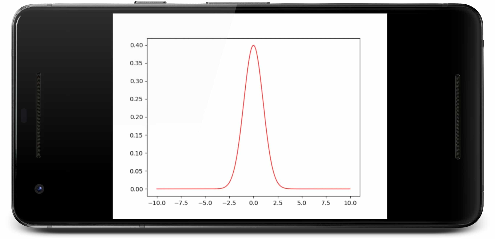 <br>
 
### 3) Graphic image file
The generated graphic will be automatically saved with name "normal_pdf.jpg" <br>
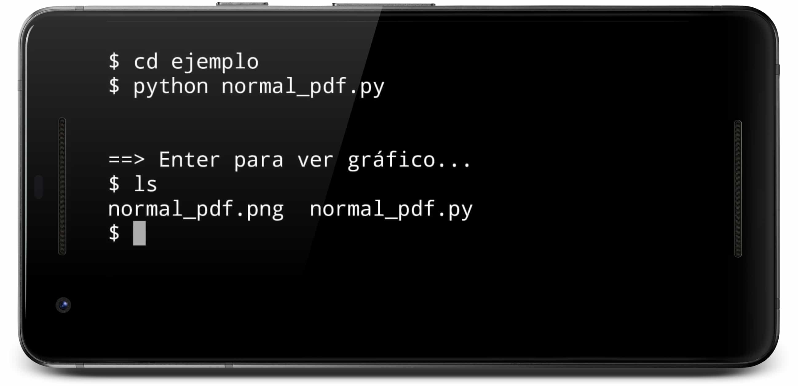 <br>

## Made by
[Natan Vilchis](https://natanvilchis.org) <br>
Repository used to help this script: [its-pointless-gcc_termux](https://github.com/its-pointless/gcc_termux)

## License
This project is licensed under the MIT license, see [LICENSE](LICENSE) to see the details.
